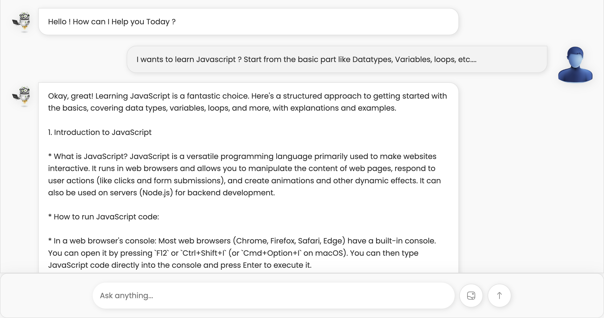
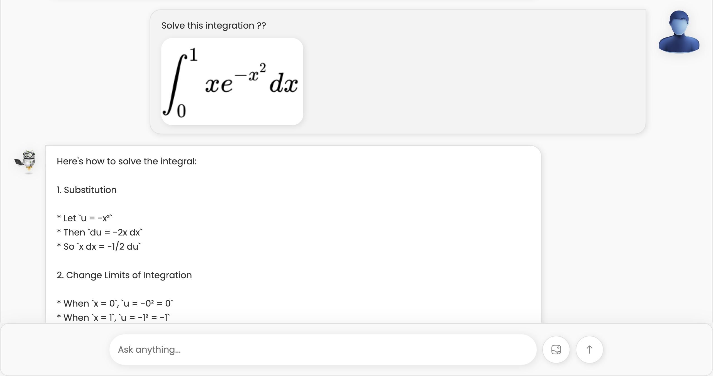
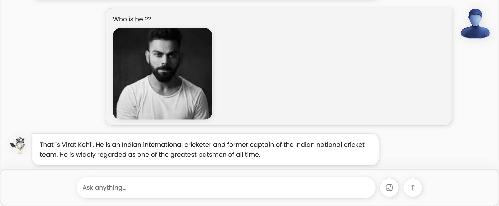
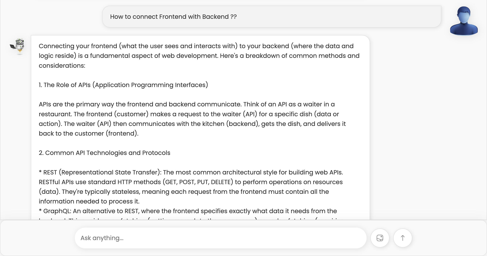

## 🌐 Live Demo:-

# AI Chat Assistant

AI Chat Assistant is an interactive web-based chatbot application designed to simulate conversations between users and an AI assistant. It features a clean and responsive interface, allowing users to send text messages, upload images, and receive AI-generated responses. This project demonstrates the integration of modern web technologies and APIs to create a dynamic and engaging user experience.

---

## Screenshot

## Asked to explain me what is Javascript:-

## Asked to solve the integration:-

## Gave the image and told to identify this man:-

## Asked to How to connect Frontend with Backend:-



## 🌟 Features

- **Interactive Chat Interface**: A visually appealing and responsive chat interface for seamless user interaction.
- **AI-Powered Responses**: Generates intelligent and context-aware responses using the Google Generative Language API.
- **File Upload Support**: Users can upload images, which are displayed in the chat interface.
- **Real-Time Feedback**: Smooth animations and loading indicators for a polished user experience.
- **Responsive Design**: Fully optimized for desktop and mobile devices.

---

## 📖 How It Works
**1.User Interaction**:
    Users can type their queries in the input field and press "Enter" or click the submit button to send the message.
    Users can also upload images using the file upload button, which will be displayed in the chat interface.
**2.AI Processing**:
    The AI processes the user's input using the Google Generative Language API.
    While the AI generates a response, a loading animation is displayed to indicate that the system is working.
**3.Dynamic Chat Updates**:
    The user's message and the AI's response are dynamically added to the chat interface.
    The chat container automatically scrolls to the latest message for a seamless experience.

## 🛠️ Technologies Used

- **HTML5**: For structuring the web page.
- **CSS3**: For styling and creating a responsive design.
- **JavaScript (ES6)**: For adding interactivity and handling API calls.
- **Google Generative Language API**: For generating AI responses.

---

## 📂 Project Structure
Ai Chat Bot/ ├── index.html # Main HTML file for the application ├── style2.css # CSS file for styling the chat interface ├── script.js # JavaScript file for chat functionality ├── assets/ # Folder containing images and other assets └── readme.md # Project documentation

---

## 🚀 How to Run the Project

**1.Clone the Repository:** 
    ```bash
    git clone https://github.com/your-username/ai-chat-assistant.git
**2.Navigate to the Project:**
    cd ai-chat-assistant
**3.Open the Application:**
    Open the index.html file in any modern web browser.


## 📝 License**
This project is open-source and available under the MIT License.

## 👨‍💻 About the Developer
Hi, **I'm Aryan Raj**, a passionate web developer with a keen interest in building interactive and user-friendly web applications. Feel free to connect with me on **LinkedIn(linkedin.com/in/aryan-kumar-220791278)** or check out my other projects on GitHub.

## ⭐ Acknowledgments
 * Google Generative Language API for powering the AI responses.
 * Poppins Font from Google Fonts for the clean typography.
 * Inspiration from modern chatbot    designs.
